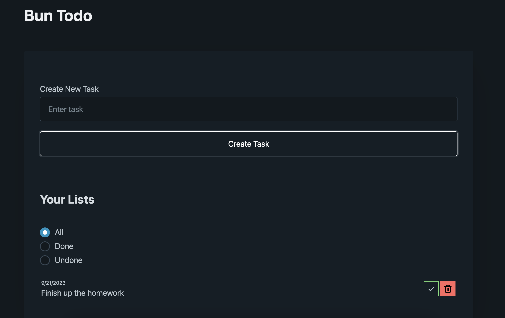

# bun-todo-app

This is a todo application created using Bun, a fast all-in-one JavaScript runtime.

## Installation

To install the dependencies, run the following command:

```
bun install
```

## Running the Application

To run the application, use the following command:

```
bun run index.tsx
```

## Project Structure

The project consists of the following files:

- `index.html`: Contains the HTML structure of the application.

- `index.tsx`: Contains the main TypeScript file for the application.

- `package.json`: Contains the project configuration and dependencies.

- `404.html`: Contains the HTML for the 404 Not Found page.

- `tsconfig.json`: Contains the TypeScript compiler configuration.

## Screenshot of Interface



